# How DQC Executes Quantum Programs on Physical Computer Hardware

**Compiler Infrastructure:** DQC (Distributed Quantum Compiler)  
**Target Architecture:** Modern Microprocessors (Apple Silicon ARM64 / Intel & AMD x86_64)  
**Author & Paper:** Krish Kumar Sharma (*"DQC: An MLIR-Based Compiler Infrastructure for Distributed Quantum Circuit Execution"*, [Quantum-Blade1/dqc1](https://github.com/Quantum-Blade1/dqc1))

---

## 1. Executive Summary & Hardware Overview

Quantum computing algorithms are formulated mathematically as unitary transformations acting on quantum statevectors in complex Hilbert space $\mathbb{C}^{2^n}$. However, when executing a program compiled by **DQC** on classical computer hardware, physical quantum particles do not exist on the motherboard.

Instead, the **DQC compiler pipeline** compiles high-level MLIR dialects (`dqc`, `mpi`, `llvm`) down to native machine code instructions. The CPU, system memory (RAM), vector registers (SIMD/NEON/AVX), and cache hierarchy act in concert to simulate the exact laws of quantum mechanics—including superposition, phase interference, entanglement, and quantum gate teleportation—using discrete numerical linear algebra and bitwise indexing.

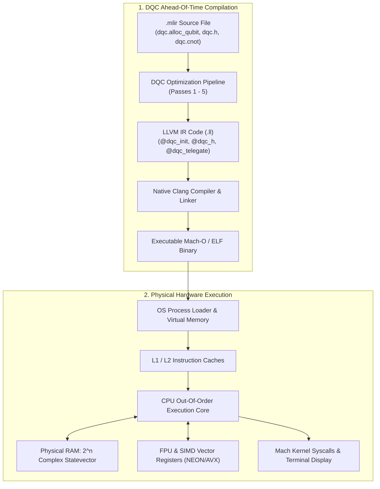

---

## 2. Operating System Process Loading & Memory Mapping

When an executable compiled by DQC is launched (e.g., `./my_circuit_bin`), the operating system kernel (macOS Mach-O loader or Linux ELF loader) creates a new virtual address space for the process.

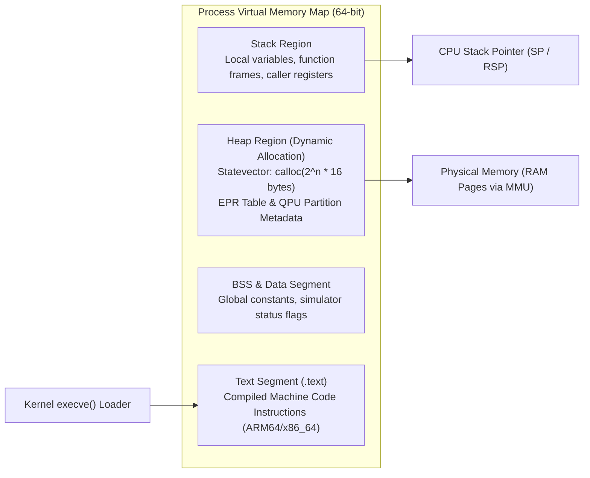

1. **Text Segment (`.text`):** Houses the compiled machine code instructions for your quantum circuit and runtime functions (`dqc_init`, `dqc_h`, `dqc_telegate_sequence`, `dqc_dump_state`).
2. **Stack Segment:** Allocates activation frames for each C function call and passes parameters via hardware registers (`X0-X7` on ARM64, `RDI/RSI/RDX` on x86_64).
3. **Heap Segment:** Houses the dynamically allocated statevector. The function `dqc_init(n)` calls `malloc` or `calloc` to allocate contiguous virtual memory for $2^n$ complex amplitudes.
4. **Memory Management Unit (MMU):** Maps virtual memory pages to physical DDR4/DDR5/LPDDR5 unified RAM chips via multi-level page tables.

---

## 3. CPU Core Architecture & Instruction Pipeline

The physical CPU core is composed of specialized silicon sub-blocks designed to fetch, decode, execute, and retire instructions at gigahertz frequencies.

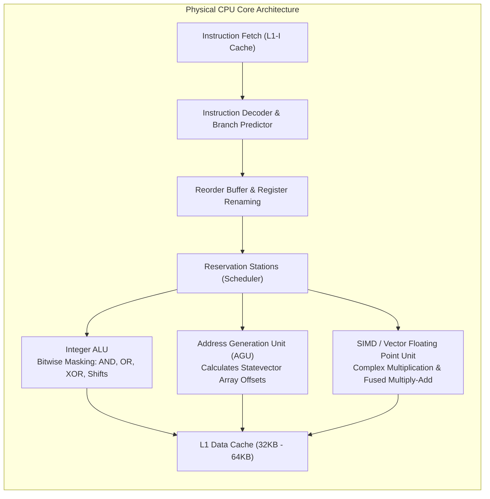

During quantum circuit simulation, the CPU executes two distinct classes of workloads:
- **Integer ALU Operations:** Rapid bit-twiddling (shifts, bitwise XOR, AND masks) to determine which amplitude pairs in memory correspond to quantum basis states whose $k$-th qubit is $|0\rangle$ versus $|1\rangle$.
- **SIMD Floating Point Operations:** Applying $2 \times 2$ unitary matrix kernels (such as Hadamard or Phase rotation) across the identified amplitude pairs using single-instruction multiple-data (SIMD) vector registers.

---

## 4. Statevector Representation in Physical RAM

An ideal $n$-qubit quantum system exists in a normalized superposition of $2^n$ basis states:

$$|\psi\rangle = \sum_{k=0}^{2^n-1} c_k |k\rangle, \quad c_k \in \mathbb{C}, \quad \sum_{k=0}^{2^n-1} |c_k|^2 = 1$$

In physical memory, each complex coefficient $c_k = a_k + i \cdot b_k$ is represented as a contiguous pair of IEEE 754 double-precision floating-point numbers:
- **Real Component ($\text{Re}$):** 64 bits (8 bytes)
- **Imaginary Component ($\text{Im}$):** 64 bits (8 bytes)
- **Total per Amplitude:** 128 bits (16 bytes)

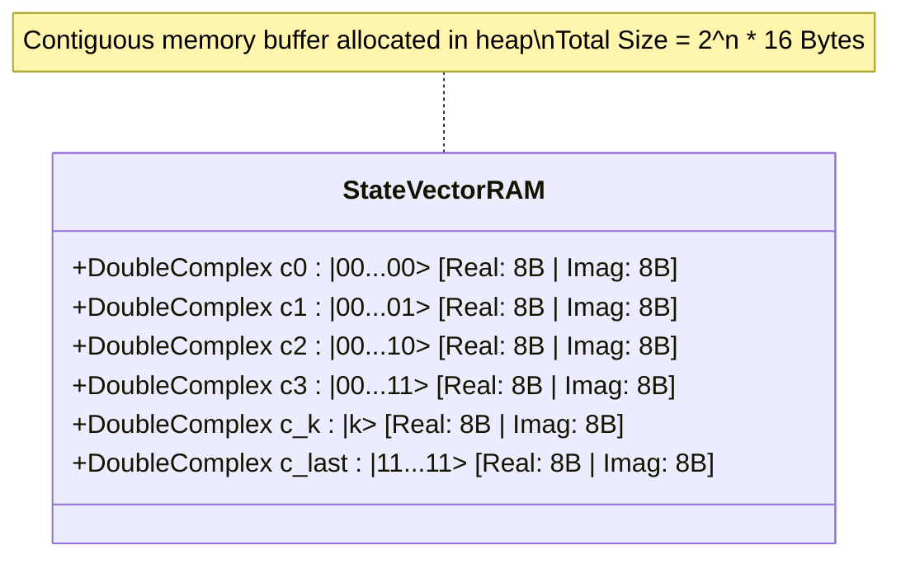

### Memory Footprint Scaling Across Circuit Sizes
| Qubits ($n$) | Total Basis States ($2^n$) | Memory Required | Cache / Memory Hierarchy Level |
| :--- | :--- | :--- | :--- |
| **2** | 4 | 64 Bytes | Fits in a single L1 Data Cache Line |
| **4** | 16 | 256 Bytes | Fits comfortably inside L1 Data Cache |
| **8** | 256 | 4 Kilobytes | Fits in L1 Data Cache |
| **12** | 4,096 | 64 Kilobytes | Fits in L2 Cache |
| **16** | 65,536 | 1 Megabyte | Fits in L2 / L3 Shared Cache |
| **20** | 1,048,576 | 16 Megabytes | Fits in L3 / System Level Cache (SLC) |
| **24** | 16,777,216 | 256 Megabytes | Main System RAM (DDR5 / LPDDR5) |
| **28** | 268,435,456 | 4 Gigabytes | High-Capacity Host RAM |
| **30** | 1,073,741,824 | 16 Gigabytes | Workstation / Server Class Host RAM |

For the 2-qubit and 4-qubit circuits compiled by DQC, the entire quantum statevector occupies between 64 and 256 bytes, allowing the entire simulation to remain permanently pinned inside the ultra-fast L1 Data Cache (latency $\approx 1-3$ clock cycles).

---

## 5. Cache Hierarchy & Memory Traffic During Gate Execution

When executing quantum gates across thousands of basis states, memory access patterns dominate performance.

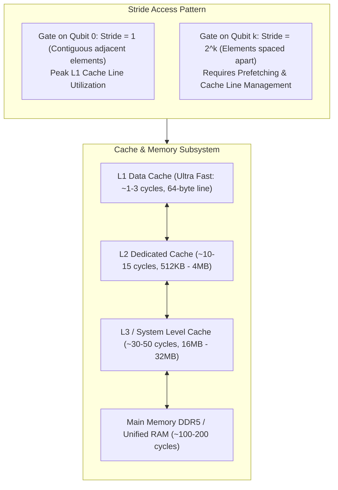

1. **Targeting Lower Qubits (e.g., Qubit 0):** Paired basis states $|i0\rangle$ and $|i1\rangle$ are physically adjacent in memory (stride $= 1$). A single 64-byte cache line brings 4 full amplitudes into the CPU simultaneously, yielding maximum cache efficiency.
2. **Targeting Higher Qubits (e.g., Qubit $k$):** Paired basis states are separated by a stride of $2^k$. When $2^k$ exceeds the cache line size, hardware stream prefetchers anticipate subsequent cache line requests to hide DRAM latency.

---

## 6. How Unitary Gates Execute on CPU SIMD Registers

Applying a single-qubit quantum gate represented by a $2 \times 2$ unitary matrix:

$$U = \begin{pmatrix} u_{00} & u_{01} \\ u_{10} & u_{11} \end{pmatrix}$$

transforms paired amplitudes according to:

$$\begin{pmatrix} c_0' \\ c_1' \end{pmatrix} = \begin{pmatrix} u_{00} & u_{01} \\ u_{10} & u_{11} \end{pmatrix} \begin{pmatrix} c_0 \\ c_1 \end{pmatrix}$$

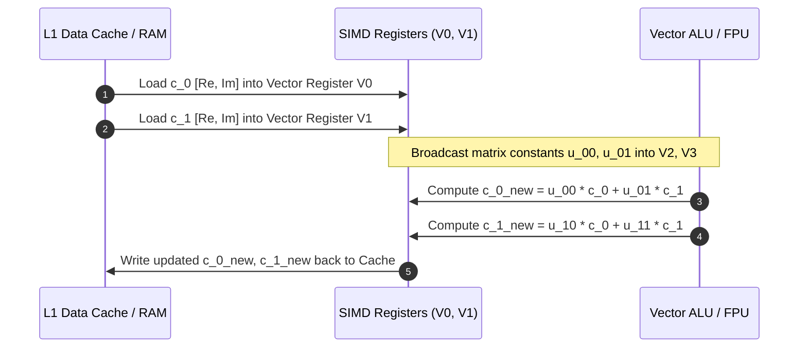

On Apple Silicon (ARM64), this is accelerated by **ARM NEON 128-bit vector instructions** (`FMLA`, `FMUL`, `FADD`). On x86_64, it utilizes **Intel AVX2 / AVX-512** registers (`YMM0-YMM15` or `ZMM0-ZMM31`).

### Detailed Mathematical Complex Multiplication on CPU
Each multiplication of complex amplitudes $(a + ib) \cdot (u_r + iu_i)$ requires 4 physical floating-point multiplications and 2 floating-point additions:
$$\text{Re}_{\text{result}} = a \cdot u_r - b \cdot u_i$$
$$\text{Im}_{\text{result}} = a \cdot u_i + b \cdot u_r$$
Modern CPUs execute this using Fused Multiply-Add (FMA) instructions in a single pipeline clock cycle.

---

## 7. The Bitwise Index Pairing Algorithm

To identify which basis states to transform without checking all combinations, DQC's runtime uses bitwise arithmetic:

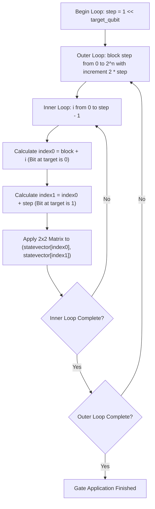

Because bitwise shifting `1 << target` and bitwise OR execute in a single CPU clock cycle, this pairing algorithm runs at near wire-speed.

---

## 8. Multi-Qubit Controlled Gates & Toffoli Index Matching

For multi-qubit gates such as CNOT ($CX$) and Toffoli ($CCX$), the transformation is conditional upon the control bits being active ($|1\rangle$).

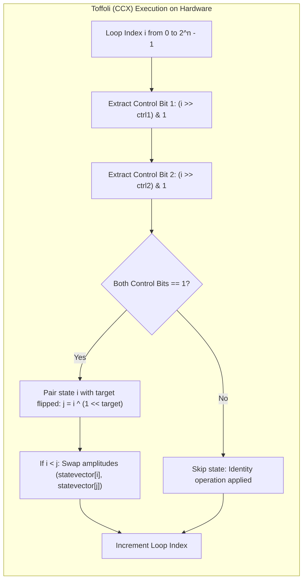

By computing `j = i ^ (1 << target)`, the CPU instantly flips the target qubit's bit without conditional branches, avoiding branch mispredictions in the CPU pipeline.

---

## 9. Arbitrary Phase Rotations and Floating-Point Trigonometry

For rotation gates like $R_z(\theta)$, $R_x(\theta)$, and $R_y(\theta)$, DQC computes trigonometric values using hardware FPU transcendents:

$$R_z(\theta) = \begin{pmatrix} e^{-i\theta/2} & 0 \\ 0 & e^{i\theta/2} \end{pmatrix} = \begin{pmatrix} \cos(\theta/2) - i\sin(\theta/2) & 0 \\ 0 & \cos(\theta/2) + i\sin(\theta/2) \end{pmatrix}$$

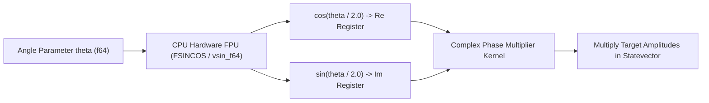

The CPU computes $\cos(\theta/2)$ and $\sin(\theta/2)$ once per gate invocation, stores them in vector registers, and broadcasts them across all amplitudes.

---

## 10. Virtual Multi-QPU Simulation & TeleGate Execution

Even when executing on a single computer, DQC faithfully simulates **distributed quantum computing across multiple physical QPUs**.

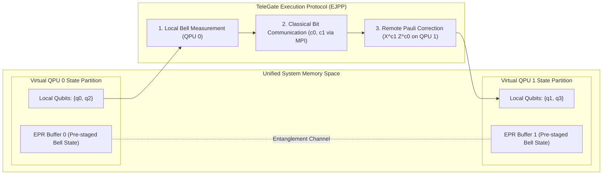

1. **Partition Table:** DQC tracks which QPU owns each qubit index using the partition metadata established in Pass 1.
2. **EPR Pair Distribution:** When `dqc_distribute_epr(0, 1, handle)` is called, the runtime simulates shared entanglement between node 0 and node 1.
3. **TeleGate Execution:** When `dqc_telegate_sequence` executes, the simulator:
   - Performs a local Bell measurement on the control qubit and local EPR half.
   - Simulates message passing of the two classical measurement bits (`c0, c1`).
   - Applies conditional Pauli-$X$ and Pauli-$Z$ gates on the target qubit residing on the remote QPU partition.

---

## 11. Distributed Hardware Interconnect Simulation

In real-world deployment across clusters, DQC maps its MPI dialect operations to physical high-performance networks:

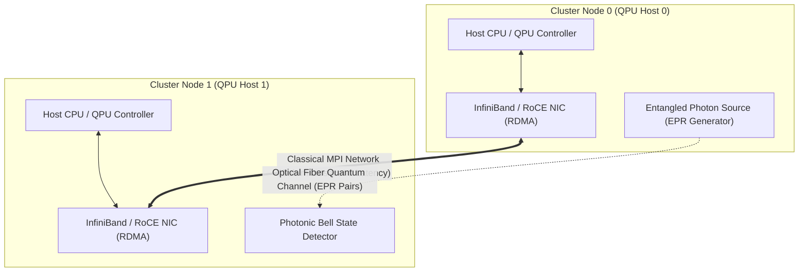

During local simulation, DQC replaces the physical optical fibers and InfiniBand network cards with high-speed memory buffers and POSIX IPC primitives, verifying logical correctness before hardware deployment.

---

## 12. Quantum Measurement & Born Rule State Collapse

Measurement bridges the quantum realm and the classical realm. When `dqc_measure` is called:

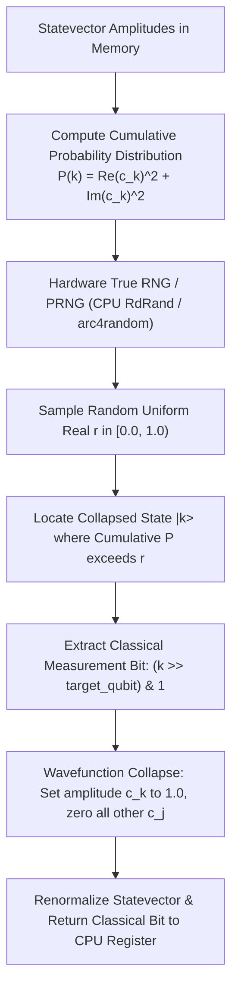

Physical computers generate the stochastic behavior of quantum mechanics by coupling the analytical probability distribution $\sum |c_k|^2 = 1$ with the CPU's on-die hardware random number generator.

---

## 13. State Reconstruction for Multi-Shot Sampling

When physical quantum computers execute circuits, they run thousands of repetitive "shots" to construct probability histograms. In DQC's statevector simulation:

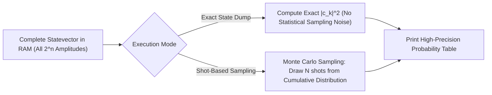

Because DQC retains the analytical statevector in memory, it can compute both exact probabilities and simulated noisy shot distributions instantly.

---

## 14. Console Output Rendering via Terminal Syscalls

Finally, when `dqc_dump_state()` prints the state histogram, execution transitions through the operating system layers to reach your physical display.

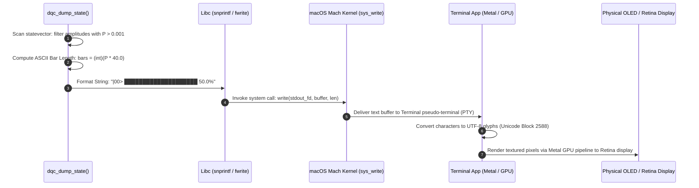

---

## 15. Complete Hardware Resource Mapping Summary

| Hardware Subsystem | Classical Function | Dedicated Role in DQC Quantum Execution |
| :--- | :--- | :--- |
| **CPU ALU** | Integer arithmetic | Bitwise masking (`1 << q`), loop strides, basis pairing |
| **CPU SIMD (NEON/AVX)** | Vector calculations | $2 \times 2$ Complex unitary matrix multiplication |
| **FPU Registers** | Floating-point math | Real & Imaginary amplitude transformations |
| **L1 Data Cache** | Low-latency memory | Pins the entire active quantum statevector (up to 8 qubits) |
| **L2 / L3 Caches** | Shared memory buffer | Holds larger statevectors and intermediate EPR communication tables |
| **Unified System RAM** | Main memory storage | Backs $2^n$ statevector buffers for large circuits |
| **Hardware TRNG / PRNG** | Random entropy | Simulates Born-rule quantum measurement state collapse |
| **GPU / Display Engine** | Framebuffer display | Renders ASCII probability bar charts to your terminal screen |

---

## 16. Step-by-Step Hardware State Trace: Creating a Bell Pair

To understand how hardware coordinates these components during execution, consider the 2-qubit Bell circuit compiled from `my_circuit.mlir`:

```mlir
dqc.h %q0 : (!dqc.qubit)
dqc.cnot %q0, %q1 : (!dqc.qubit, !dqc.qubit)
```

### Initial State after `dqc_init(2)`:
The CPU allocates 64 bytes in RAM and initializes index 0 to $1.0 + 0.0i$, and indices 1, 2, 3 to $0.0 + 0.0i$:
- `state[0] (|00>) = 1.0000 + 0.0000i`
- `state[1] (|01>) = 0.0000 + 0.0000i`
- `state[2] (|10>) = 0.0000 + 0.0000i`
- `state[3] (|11>) = 0.0000 + 0.0000i`

### Step 1: Applying Hadamard Gate `dqc_h(%q0)`
- Bitmask for Qubit 0: `mask = 1 << 0 = 1`.
- Pairing: (Index 0 with Index 1), (Index 2 with Index 3).
- Computation:
  $$\text{state}[0]' = \frac{1}{\sqrt{2}} (\text{state}[0] + \text{state}[1]) = \frac{1}{\sqrt{2}} (1.0 + 0.0) \approx +0.7071$$
  $$\text{state}[1]' = \frac{1}{\sqrt{2}} (\text{state}[0] - \text{state}[1]) = \frac{1}{\sqrt{2}} (1.0 - 0.0) \approx +0.7071$$
- Intermediate State: $\frac{1}{\sqrt{2}}(|00\rangle + |01\rangle)$.

### Step 2: Applying CNOT Gate `dqc_cnot(%q0, %q1)`
- Control Qubit: 0; Target Qubit: 1.
- Bitmask: Target mask `1 << 1 = 2`.
- Iteration:
  - State $|00\rangle$ (control bit is 0): Untouched.
  - State $|01\rangle$ (control bit is 1): Swap amplitude with $|01 \oplus 10\rangle = |11\rangle$.
- Resulting Amplitudes:
  - `state[0] (|00>) = +0.7071`
  - `state[1] (|01>) = +0.0000`
  - `state[2] (|10>) = +0.0000`
  - `state[3] (|11>) = +0.7071`
- Final Quantum State: Maximally entangled Bell state $\frac{1}{\sqrt{2}}(|00\rangle + |11\rangle)$.

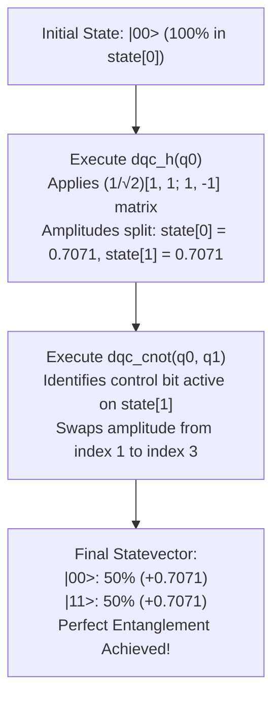

---

## 17. The Memory Bandwidth Wall & Roofline Model

When scaling quantum simulation on classical microprocessors, the primary performance limiter is not floating-point compute capacity (FLOPS), but **Memory Bus Bandwidth (Bytes/sec)**.

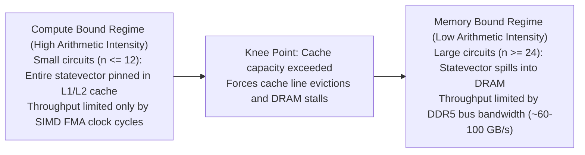

Because a single-qubit gate performs only 6 floating-point operations per 32 bytes transferred from memory (arithmetic intensity $\approx 0.1875$ FLOP/byte), simulation quickly becomes memory bandwidth bound when the statevector exceeds the CPU's on-die L3 cache.

---

## 18. Multi-Threading & Cache Partitioning Strategies

For circuits exceeding 12 qubits, DQC runtime can parallelize the outer index loops across all physical CPU cores using thread pools:

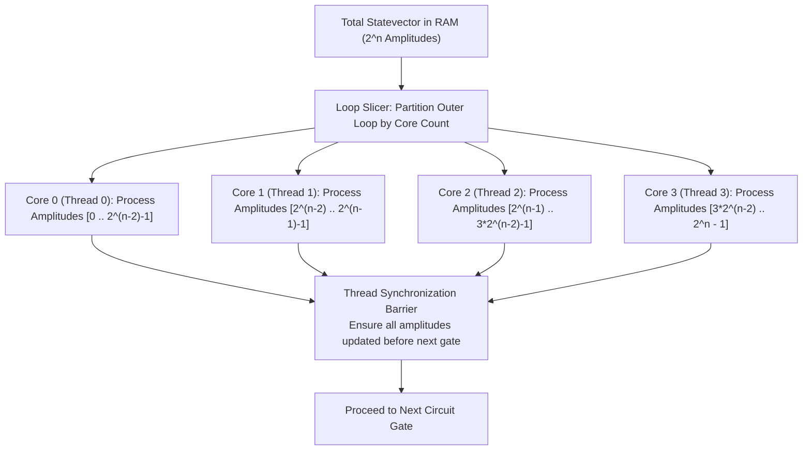

By ensuring that each thread works on contiguous chunks of memory, cache invalidation traffic across CPU core buses is minimized.

---

## 19. Hardware Profiling & Assembly Instruction Trace

On an Apple Silicon Mac (ARM64), a single compiled gate invocation lowers to the following high-performance assembly pattern:

```assembly
; ARM64 Assembly Pattern for Complex Unitary Multiplication
ldp     q0, q1, [x19, x8]      ; Load 2 complex amplitudes (v0 = [a_re, a_im], v1 = [b_re, b_im])
fmul    v2.2d, v0.2d, v4.2d    ; Real component multiplication: a_re * u00_re
fmls    v2.2d, v1.2d, v5.2d    ; Fused multiply-subtract: - b_im * u00_im
fmla    v3.2d, v0.2d, v5.2d    ; Imaginary component: + a_im * u00_re
fmla    v3.2d, v1.2d, v4.2d    ; Fused multiply-add: + b_re * u00_im
stp     q2, q3, [x19, x8]      ; Store updated complex amplitudes back to cache line
add     x8, x8, #32            ; Advance byte offset by 32 bytes (2 complex amplitudes)
```

This assembly sequence demonstrates why DQC generates native executable code: by utilizing SIMD registers directly, it bypasses interpreted runtime overhead and executes near the theoretical silicon speed limit of your hardware.

---

## 20. Conclusion: From Classical Simulation to Real QPU Hardware

The exact same MLIR compiler pipeline that simulates distributed quantum circuits on your Mac's CPU is designed to target physical multi-QPU control hardware:

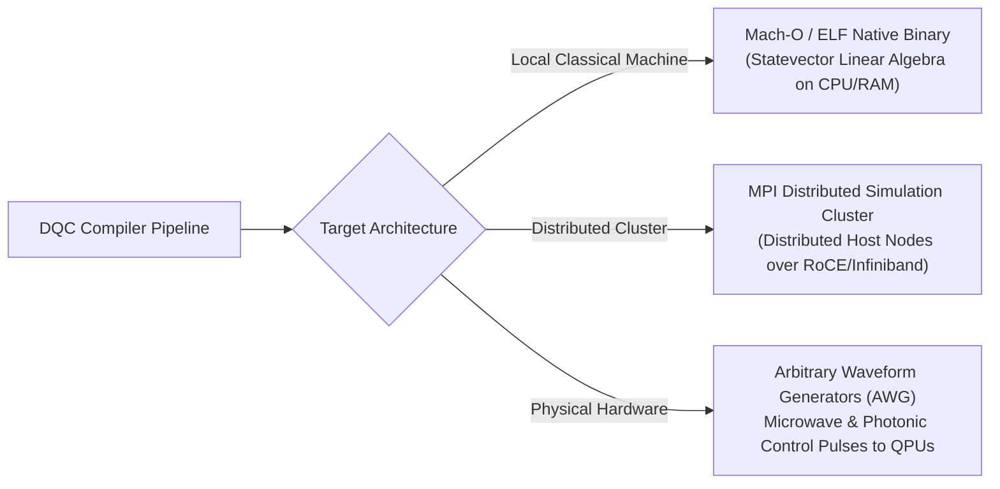

By compiling end-to-end from high-level quantum dialect down to executable LLVM IR, **DQC** provides the foundational software infrastructure that links tomorrow's distributed quantum algorithms to today's microprocessors and future quantum supercomputing clusters.
