# What Your Machine Does When Running DQC: A Visual Journey

A diagram-first explanation of how your computer hardware (CPU, RAM, Caches, and Display) compiles and executes quantum programs.

---

## The 30-Second Big Picture

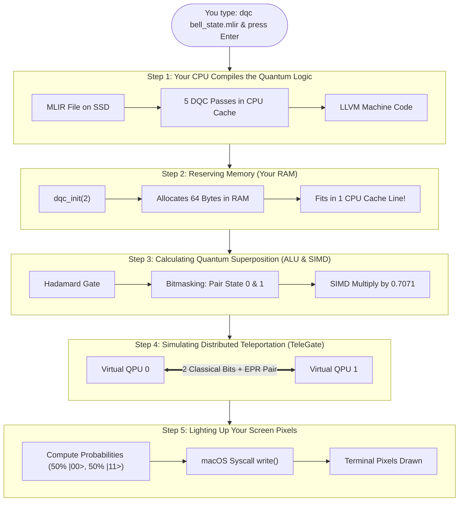

---

## Step 1: Loading from SSD into Your CPU Caches

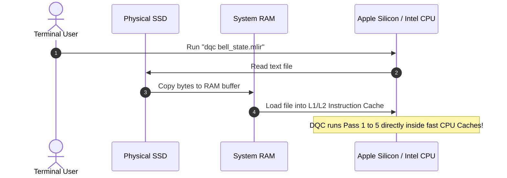

---

## Step 2: The 5 Compiler Passes Inside Your CPU

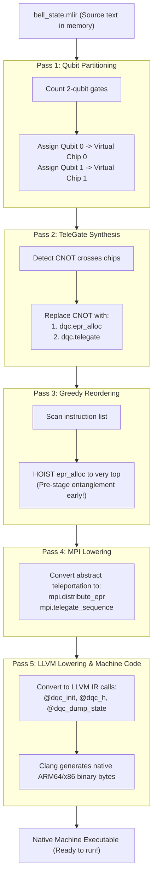

---

## Step 3: What Gets Allocated in Your Mac's RAM

For 2 qubits, there are $2^2 = 4$ possible states. Each complex number requires 16 bytes:

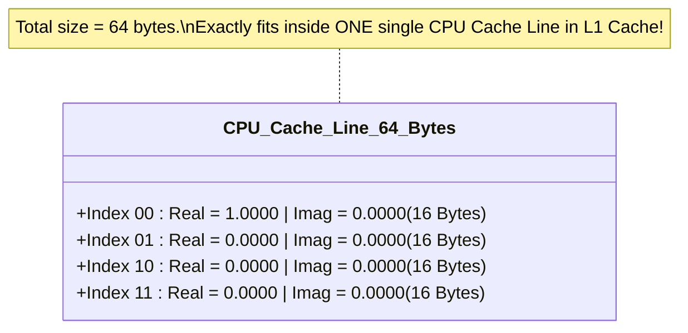

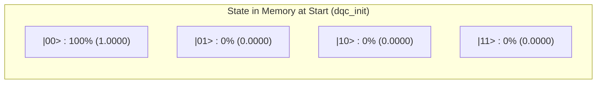

---

## Step 4: Executing Hadamard Gate `dqc.h` (ALU & SIMD Working)

Your CPU does not use physics; it uses **bitwise tricks + vector multiplications**:

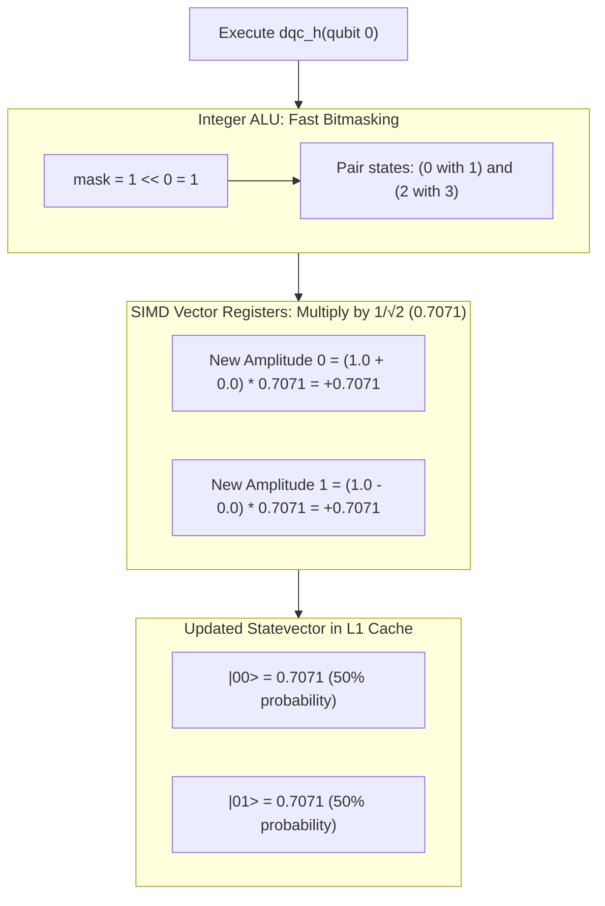

---

## Step 5: Distributed TeleGate Between Virtual Chips

How your computer pretends to have two separate physical quantum chips:

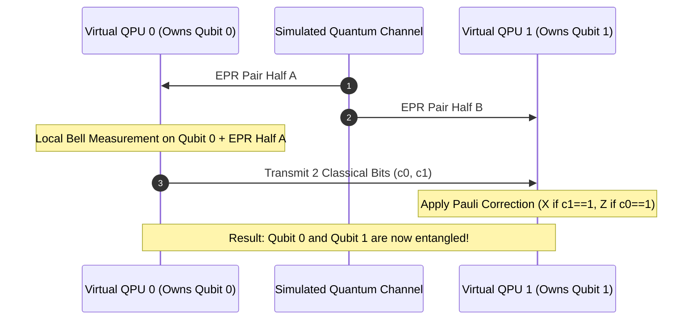

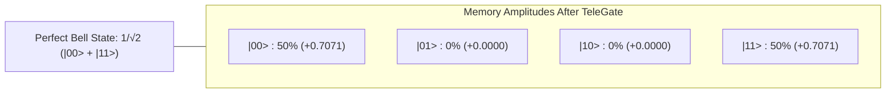

---

## Step 6: Measurement & Born Rule (Hardware Random Number Generator)

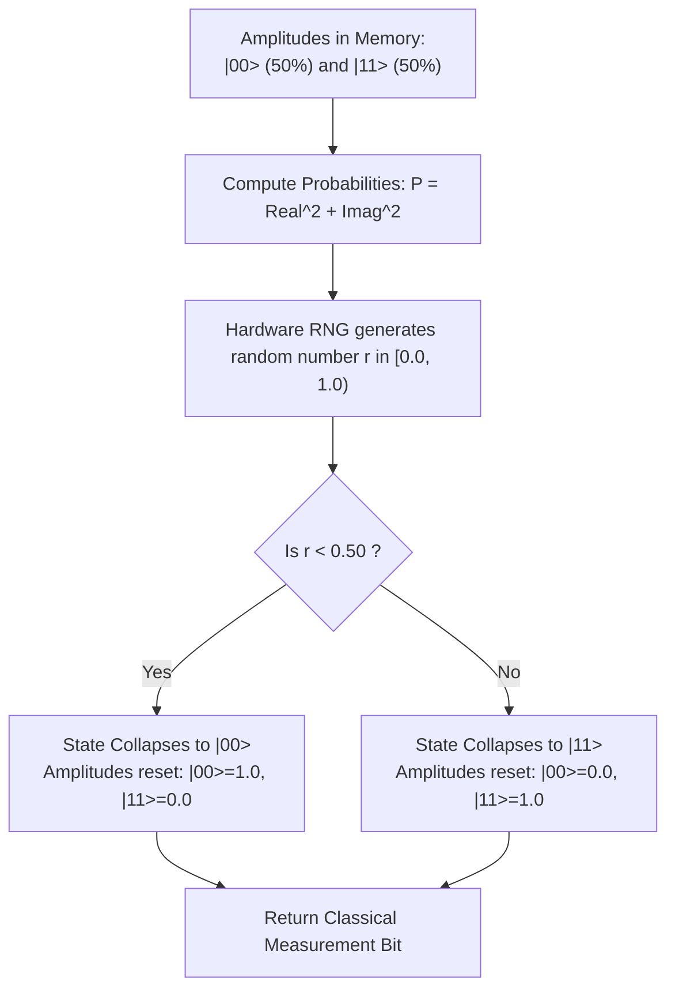

---

## Step 7: How the Histogram Reaches Your Eyeballs

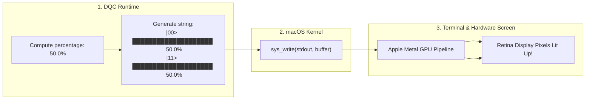

---

## Hardware Component Role Cheat-Sheet

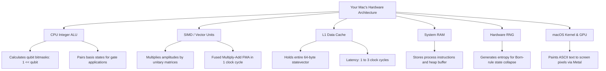

