# Deep Comparative Analysis: Classical C Compilers vs. DQC (Distributed Quantum Compiler)

**Compiler Infrastructure:** DQC (Distributed Quantum Compiler)  
**Foundational Research & Paper:** Krish Kumar Sharma (*"DQC: An MLIR-Based Compiler Infrastructure for Distributed Quantum Circuit Execution"*, [GitHub: Quantum-Blade1/dqc1](https://github.com/Quantum-Blade1/dqc1))  
**Target Systems:** Distributed Multi-QPU Quantum Supercomputers vs. Classical Von Neumann / Harvard Architectures

---

## 1. Executive Summary & Paradigm Divergence

Modern computer science rests upon compiler infrastructures that transform human-readable source abstractions into machine-executable instructions. For over five decades, classical compilers like **GCC** (GNU Compiler Collection) and **Clang/LLVM** have refined the compilation of imperative, sequential programming languages (such as C, C++, and Rust) targeting von Neumann microprocessors.

With the advent of physical quantum computing, a radically different execution model has emerged. **DQC (Distributed Quantum Compiler)** is an open-source, MLIR-native compiler specifically engineered to solve the multi-QPU scaling challenge. Unlike classical compilers that schedule arithmetic instructions across register files and memory hierarchies, DQC partitions quantum circuits across discrete, network-linked **Quantum Processing Units (QPUs)** and synthesizes entanglement-assisted quantum communication channels.

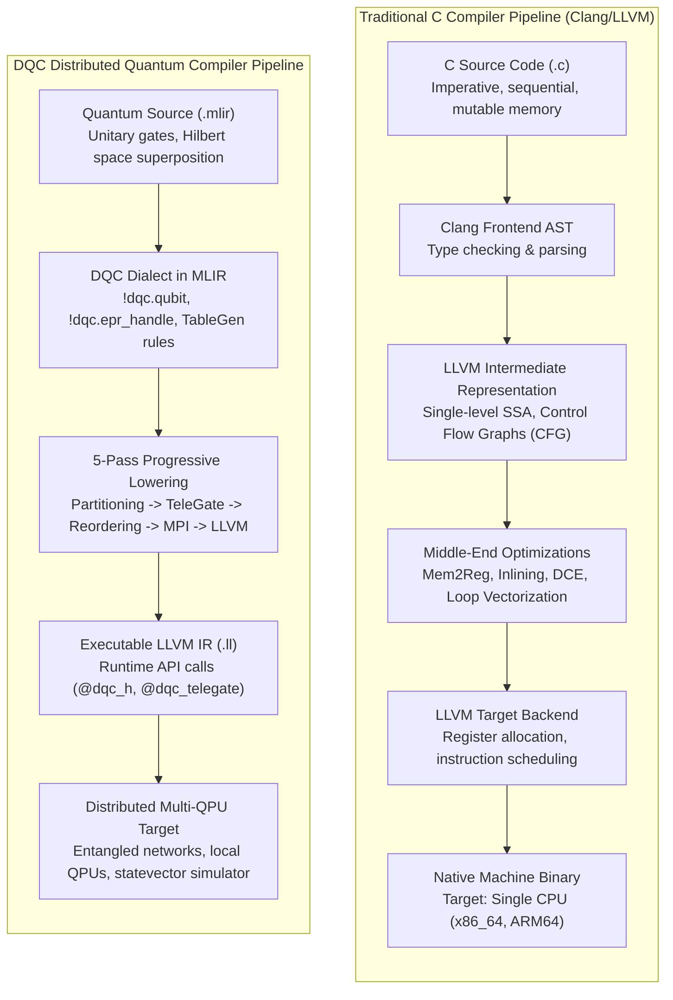

---

## 2. DQC Architectural Framework & The 5-Pass Progressive Pipeline

DQC leverages the **Multi-Level Intermediate Representation (MLIR)** framework, an extensible sub-project of LLVM. MLIR allows compilers to define domain-specific abstractions called **dialects** and lower them progressively through multiple layers of intermediate representation.

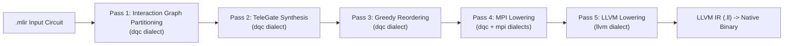

### Pass 1: Interaction Graph Partitioning
* **Mathematical Mechanics:** Pass 1 models the quantum circuit as an undirected, weighted interaction graph $G = (V, E, w)$. Each vertex $v_i \in V$ represents a logical qubit. Each edge $(v_i, v_j) \in E$ represents a physical two-qubit interaction (e.g., CNOT, CZ, SWAP), weighted by the execution frequency $w(v_i, v_j)$. The pass computes a balanced graph bisection that minimizes the weighted edge-cut cost:
  $$C = \sum_{(v_i, v_j) \in E_{\text{cut}}} w(v_i, v_j)$$
* **Why It Is Used:** Physical quantum interconnects have limited bandwidth and coherence times. Minimizing the edge cut directly minimizes the number of cross-chip operations required.
* **Pass 1 Output Excerpt:**
  ```mlir
  func.func @my_circuit() attributes {
    dqc.edge_cut_cost = 1.000000e+00 : f32,
    dqc.partition = {qubit_0 = 0 : i32, qubit_1 = 1 : i32}
  } {
    %0 = dqc.alloc_qubit : !dqc.qubit
    %1 = dqc.alloc_qubit : !dqc.qubit
    dqc.h %0 : (!dqc.qubit)
    dqc.cnot %0, %1 : (!dqc.qubit, !dqc.qubit)
    return
  }
  ```

### Pass 2: TeleGate Synthesis
* **Mathematical Mechanics:** Scans all two-qubit operations against the partition mapping. Any gate whose operands reside on distinct QPUs cannot be physically executed using on-chip couplers. Pass 2 replaces the cross-chip gate with the **Eisert-Jacobs-Papadopoulos-Plenio (EJPP)** quantum gate teleportation protocol:
  1. An entangled Bell state allocation (`dqc.epr_alloc`).
  2. A remote teleportation sequence (`dqc.telegate`) comprising local Bell measurements, classical message passing of two bits, and conditional Pauli corrections ($X^{c_1} Z^{c_0}$) on the remote node.
* **Why It Is Used:** Enables arbitrary cross-chip quantum logic without requiring physical qubit shuttling or moving hardware components.
* **Pass 2 Output Excerpt:**
  ```mlir
  %2 = dqc.epr_alloc 0, 1 : !dqc.epr_handle
  dqc.telegate %0, %1, %2 {control_qpu = 0 : i32, target_qpu = 1 : i32} : !dqc.qubit, !dqc.qubit, !dqc.epr_handle
  ```

### Pass 3: Greedy Reordering
* **Mathematical Mechanics:** Analyzes data dependencies across operations. It hoists all `dqc.epr_alloc` operations to the function preamble, preceding all computational gate operations.
* **Why It Is Used:** Entanglement generation across optical or cryogenic links has non-zero physical latency. Hoisting EPR allocations enables **batch entanglement pre-staging**: all EPR pairs can be generated and distributed in a single communication round prior to circuit execution, preventing pipeline stalls.
* **Pass 3 Output Excerpt:**
  ```mlir
  // Hoisted to top of function preamble
  %2 = dqc.epr_alloc 0, 1 : !dqc.epr_handle
  // Subsequent gate logic proceeds without entanglement latency
  dqc.h %0 : (!dqc.qubit)
  dqc.telegate %0, %1, %2 {control_qpu = 0 : i32, target_qpu = 1 : i32} ...
  ```

### Pass 4: MPI Lowering
* **Mathematical Mechanics:** Lowers abstract quantum operations into the concrete `mpi` dialect representing distributed message passing. `dqc.epr_alloc` becomes `mpi.distribute_epr`, and `dqc.telegate` becomes `mpi.telegate_sequence`. Local single-qubit gates remain in the `dqc` dialect.
* **Why It Is Used:** Bridges the semantic gap between abstract quantum mathematics and distributed networking primitives.
* **Pass 4 Output Excerpt:**
  ```mlir
  %2 = mpi.distribute_epr 0, 1 : !dqc.epr_handle
  mpi.telegate_sequence %0, %1, %2 {control_qpu = 0 : i32, target_qpu = 1 : i32} : (!dqc.qubit, !dqc.qubit, !dqc.epr_handle)
  ```

### Pass 5: LLVM Lowering
* **Mathematical Mechanics:** Employs MLIR's `ConversionPattern` infrastructure to lower all remaining `dqc` and `mpi` operations into the `llvm` dialect. Inserts lifecycle markers (`@dqc_init`, `@dqc_dump_state`, `@dqc_finalize`) and targets the underlying C runtime library.
* **Why It Is Used:** Produces standardized LLVM IR, allowing the entire LLVM toolchain (Clang, LLD, opt) to generate native object code and executable binaries.
* **Pass 5 Output Excerpt:**
  ```llvm
  define void @my_circuit() {
    call void @dqc_init(i32 2)
    %1 = call i32 @dqc_alloc_qubit()
    %2 = call i32 @dqc_alloc_qubit()
    call void @dqc_h(i32 %1)
    %3 = alloca i32, align 4
    call void @dqc_distribute_epr(i32 0, i32 1, ptr %3)
    %4 = load i32, ptr %3, align 4
    call void @dqc_telegate_sequence(i32 %1, i32 %2, i32 %4, i32 0, i32 1)
    call void @dqc_dump_state()
    call void @dqc_finalize()
    ret void
  }
  ```

---

## 3. Fifteen Compulsory Industry-Standard Comparisons

The table below contrasts the fundamental dimensions of classical C compilers versus the DQC compiler, followed by in-depth analyses and dedicated GitHub Mermaid diagrams for each point.

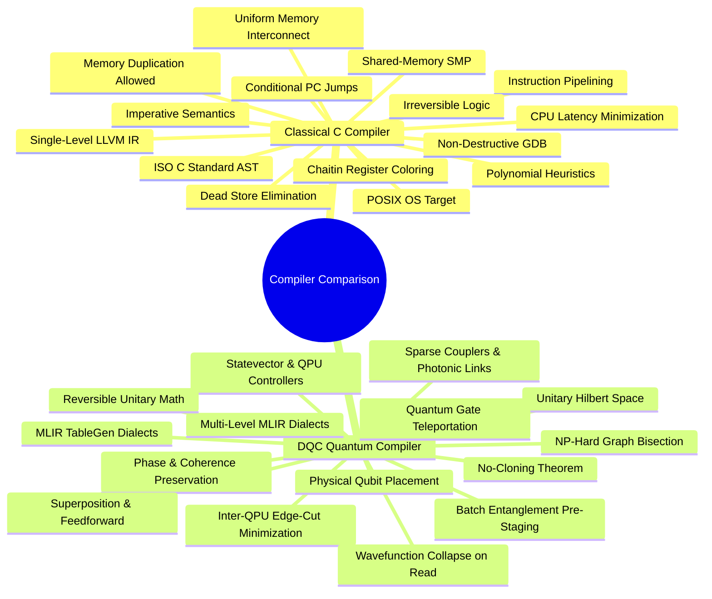

---

### Comparison 1: Source Language Semantics & Execution Models
* **Classical C Compiler:** Programs are sequences of state mutations executing on a von Neumann architecture. Memory contains deterministic scalar values updated through assignments (`x = y + z`).
* **DQC Compiler:** Programs are unitary matrix operators ($U \in U(2^n)$) transforming continuous probability amplitude vectors in complex Hilbert space $\mathbb{C}^{2^n}$.

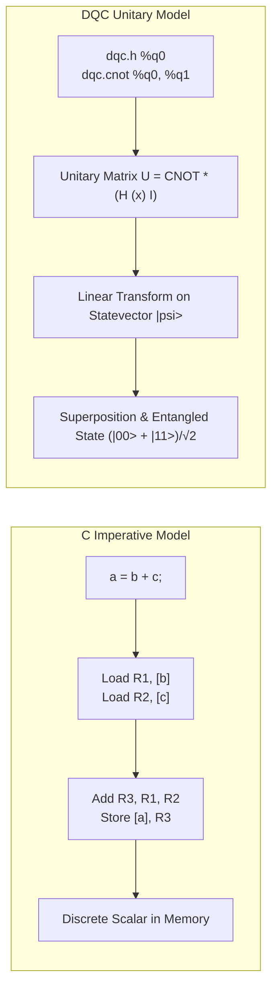

---

### Comparison 2: Intermediate Representation Hierarchy
* **Classical C Compiler:** Employs a single monolithic intermediate representation (LLVM IR or GCC GIMPLE) based on Static Single Assignment (SSA) with a fixed set of primitive types (integers, floats, pointers).
* **DQC Compiler:** Implements a **Multi-Level Dialect Hierarchy** within MLIR (`dqc` $\to$ `mpi` $\to$ `llvm`), preserving high-level quantum domain knowledge (qubit registers, EPR handles) until explicitly lowered.

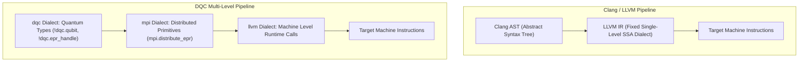

---

### Comparison 3: Memory Model and Variable Duplication
* **Classical C Compiler:** Variables can be duplicated arbitrarily via register copying or memory writes (`memcpy`, `x = y`). Reading a variable does not alter its value.
* **DQC Compiler:** Strictly governed by the **Quantum No-Cloning Theorem** ($\nexists U: |\psi\rangle|0\rangle \to |\psi\rangle|\psi\rangle$). Qubits cannot be copied; they can only be entangled or teleported.

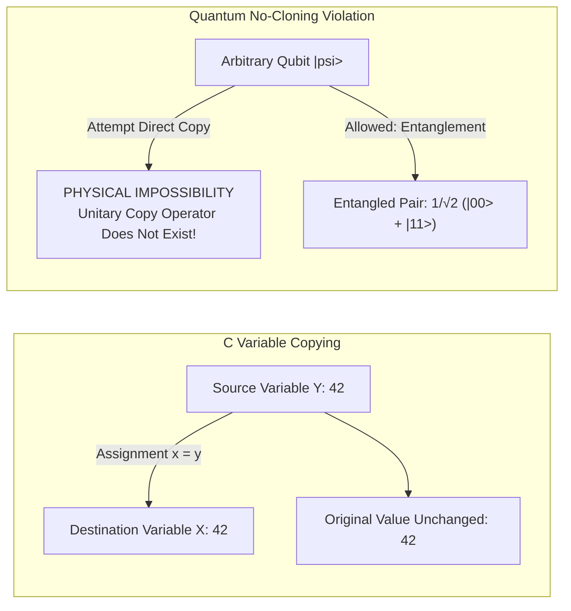

---

### Comparison 4: Optimization Target and Cost Functions
* **Classical C Compiler:** Optimizes for minimum CPU clock cycles, minimum instruction count, and maximum cache locality (L1/L2 hits).
* **DQC Compiler:** Optimizes to **minimize the inter-QPU communication volume (edge cut)**, directly reducing physical EPR pair consumption.

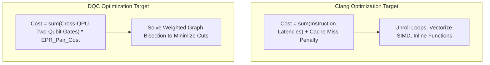

---

### Comparison 5: Distributed Concurrency & Inter-Processor Communication
* **Classical C Compiler:** Concurrency is achieved via shared memory (threads, mutexes, atomic operations) or explicit distributed messaging libraries (OpenMPI).
* **DQC Compiler:** Inter-processor communication requires **Quantum Gate Teleportation** using pre-shared entanglement and classical side-channels.

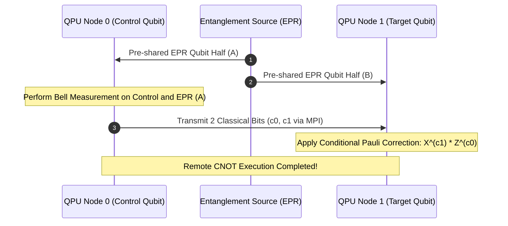

---

### Comparison 6: Resource Allocation (Registers vs. Physical Qubits)
* **Classical C Compiler:** Maps an arbitrary number of virtual variables to a small pool of physical registers (e.g., 16 registers on x86_64) using graph coloring. If registers are exhausted, variables are "spilled" to the stack in RAM.
* **DQC Compiler:** Maps virtual qubits to discrete physical QPU hardware nodes. **Qubits cannot be spilled to RAM**; state information cannot be swapped out without measuring and destroying coherence.

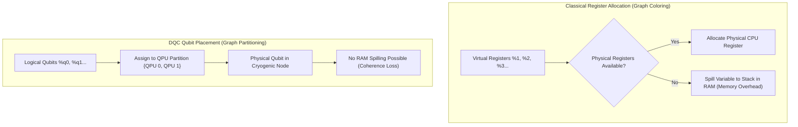

---

### Comparison 7: Dead Code Elimination (DCE)
* **Classical C Compiler:** Removes computations whose results are never read or stored to memory (`dead store elimination`).
* **DQC Compiler:** An unmeasured quantum gate **cannot be eliminated** simply because its classical output is unused. Unitary gates alter phase angles and entanglement across the entire multi-qubit system.

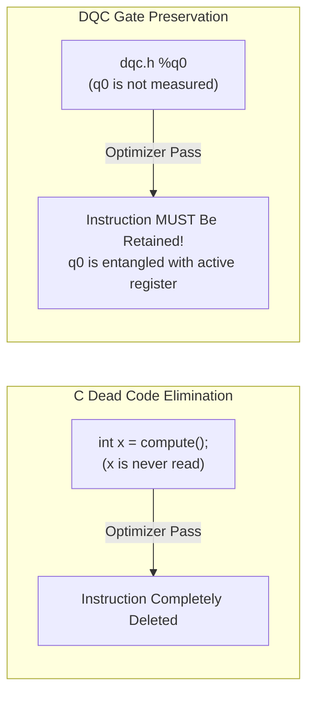

---

### Comparison 8: Instruction Scheduling & Pipelining
* **Classical C Compiler:** Schedules instructions to avoid CPU pipeline stalls, branch mispredictions, and load-to-use memory latencies.
* **DQC Compiler:** Implements **Greedy Reordering**, hoisting EPR allocations to the function preamble to enable **batch entanglement generation**, preventing execution stalls waiting for EPR distribution.

```mermaid
gantt
    title Instruction Scheduling: Classical CPU vs DQC Quantum
    dateFormat X
    axisFormat %s
    section Classical CPU Scheduling
    Load from L1 Cache :active, 0, 2
    ALU Compute :crit, 2, 4
    Store Result :active, 4, 6
    section DQC Entanglement Scheduling
    Batch Distribute 14 EPR Pairs :done, 0, 5
    Execute Local & Teleported Gates :active, 5, 10
```

---

### Comparison 9: Control Flow & Branching Mechanics
* **Classical C Compiler:** Control flow relies on program counter (PC) modifications: conditional branches (`je`, `jne`), jump tables, and loop unrolling.
* **DQC Compiler:** Quantum computation operates in **simultaneous superposition**. Branching occurs either coherently via multi-controlled unitary gates (`dqc.ccx`) or classically via mid-circuit measurement feedforward (`c_if`).

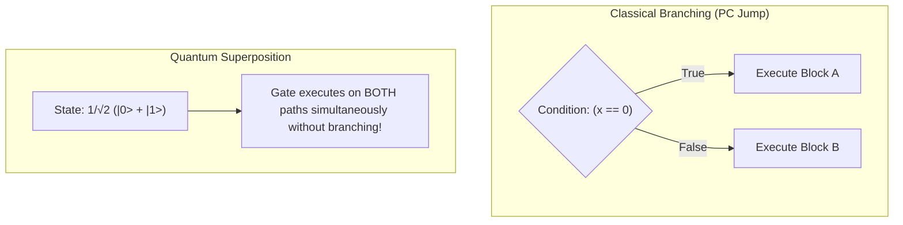

---

### Comparison 10: Runtime Environment and Linkage
* **Classical C Compiler:** Links against standard operating system runtimes (`glibc`, `musl`, macOS `libSystem`) targeting POSIX system calls.
* **DQC Compiler:** Links against a quantum simulation runtime (in C) or compiles down to low-level hardware control electronics (microwave pulse generators and AWGs).

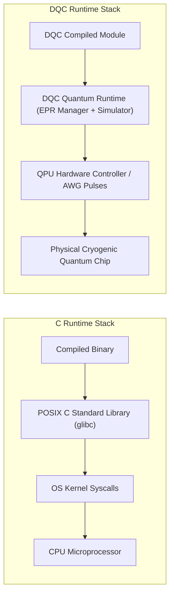

---

### Comparison 11: Hardware Interconnect Topologies
* **Classical C Compiler:** Assumes a uniform memory architecture (UMA) or non-uniform memory access (NUMA) bus where all cores can read all memory addresses.
* **DQC Compiler:** Targets **heterogeneous quantum networks** with sparse nearest-neighbor on-chip couplers and optical or cryogenic inter-chip links.

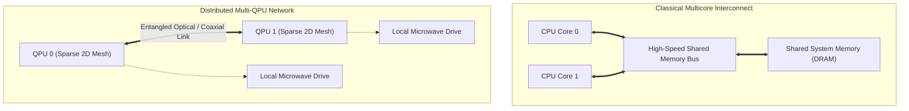

---

### Comparison 12: Debugging and State Inspection
* **Classical C Compiler:** Program state can be inspected non-intrusively at any instruction boundary using debuggers (GDB, LLDB) without altering memory contents.
* **DQC Compiler:** Inspecting a physical quantum register triggers **wavefunction collapse**, irreversibly destroying superposition. DQC provides non-demolition statevector dumping (`dqc_dump_state()`) during simulation.

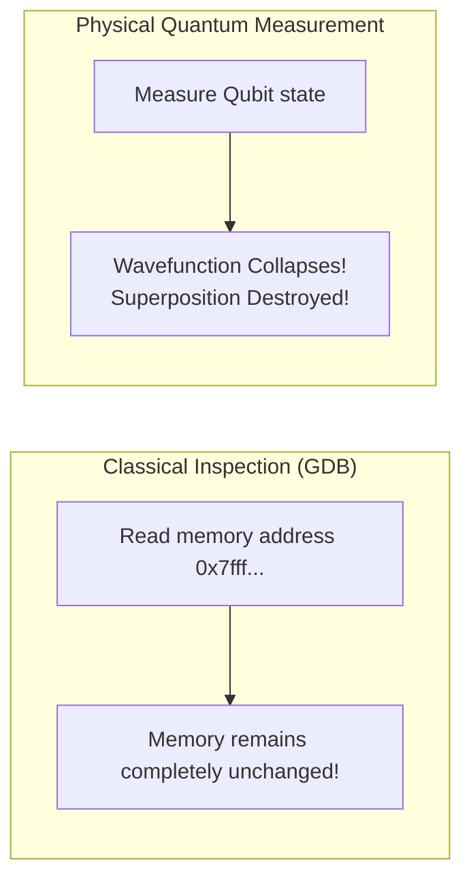

---

### Comparison 13: Reversibility & Energy Dissipation
* **Classical C Compiler:** Classical logic gates (AND, OR) are inherently irreversible, discarding input information and dissipating heat per Landauer's principle ($k_B T \ln 2$).
* **DQC Compiler:** Quantum operations are strictly unitary ($U^\dagger U = I$) and **logically reversible**. Information is conserved throughout the entire computation until final measurement.

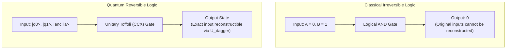

---

### Comparison 14: Algorithmic Hardness of Core Passes
* **Classical C Compiler:** Standard optimization passes (constant propagation, common subexpression elimination, loop unrolling) run in polynomial time ($O(N)$ to $O(N^2)$).
* **DQC Compiler:** The core partitioning pass (Pass 1) solves the **weighted graph bisection problem**, which is known to be **NP-hard**. DQC implements a greedy approximation heuristic to achieve scalable compile times.

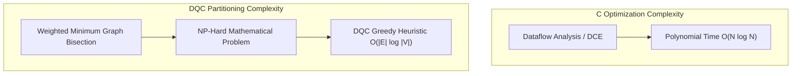

---

### Comparison 15: Extensibility and Ecosystem Standard
* **Classical C Compiler:** Bound by ANSI/ISO C language specifications; extending the language requires modifying monolithic parser frontends and complex AST nodes.
* **DQC Compiler:** Defined via **MLIR TableGen (`.td`) specifications**. New quantum operations, gates, and hardware dialects can be added declaratively with automated C++ boilerplate generation.

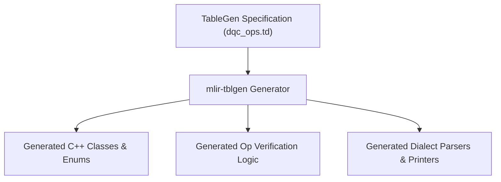

---

## 4. Summary Matrix: Classical C vs. DQC Quantum

| # | Dimension | Classical C Compiler (Clang / GCC) | DQC Quantum Compiler |
|---|:---|:---|:---|
| **1** | **Target Hardware** | Single / Multicore Classical CPU | Distributed Multi-QPU Quantum Chips |
| **2** | **Core Semantics** | Imperative state mutations | Unitary Hilbert space transformations |
| **3** | **IR Architecture** | Monolithic single-level LLVM IR | Multi-Level MLIR Dialects (`dqc` $\to$ `mpi` $\to$ `llvm`) |
| **4** | **Memory Model** | Linear address space (Stack/Heap) | $2^n$ Complex probability amplitudes |
| **5** | **Duplication** | Trivial (`memcpy`, assignment) | Strictly prohibited (No-Cloning Theorem) |
| **6** | **Optimization Goal** | Minimize instruction cycles & latency | Minimize cross-QPU edge cuts (EPR pairs) |
| **7** | **Concurrency** | Threads, shared memory, mutexes | Quantum Gate Teleportation over EPR pairs |
| **8** | **Scheduling Goal** | Pipeline hazard reduction | Batch entanglement pre-staging |
| **9** | **Register Mapping** | Virtual registers to CPU registers | Virtual qubits to physical QPU partitions |
| **10** | **Dead Code Removal**| Eliminates dead stores to RAM | Unmeasured unitary gates cannot be removed |
| **11** | **Control Flow** | Branches, jumps, loop unrolling | Coherent superposition & measurement feedback |
| **12** | **State Inspection** | Non-intrusive memory inspection | Measurement collapses statevector |
| **13** | **Reversibility** | Irreversible logic (dissipates heat)| Strictly reversible unitary operations |
| **14** | **Pass Complexity** | Polynomial time algorithms ($O(N^2)$) | NP-Hard weighted bisection problem |
| **15** | **Extensibility** | Constrained by ISO C standard ASTs | Declarative TableGen dialect generation |

---

## 5. Why DQC is Critical for the Quantum Computing Industry

### 1. The Physical Scaling Wall of Monolithic Quantum Chips
Every major quantum hardware vendor has recognized that building a single monolithic quantum chip containing millions of qubits is physically impossible due to three constraints:
1. **Dilution Refrigerator Wiring Limits:** Superconducting chips require high-density coaxial cabling operating at sub-10 millikelvin temperatures. Wiring thousands of control lines causes immense thermal leaks into cryostats.
2. **Crosstalk & Manufacturing Yield:** As physical chip area grows, microwave and magnetic crosstalk between neighboring qubits degrades two-qubit gate fidelities below error correction thresholds.
3. **Modular Future:** Quantum scaling demands modularity—multiple smaller, high-fidelity QPUs linked by quantum channels.

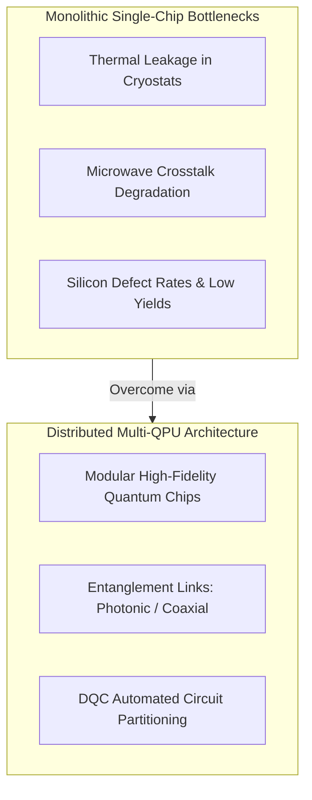

### 2. Alignment with Industry Multi-QPU Roadmaps
The quantum computing industry is actively developing distributed multi-QPU hardware:
- **IBM Quantum:** Developed the *Flamingo* architecture, demonstrating multi-QPU coupling via meter-long superconducting quantum links.
- **IonQ & Atom Computing:** Building networked ion-trap systems linked by photonic interconnects.
- **PsiQuantum:** Constructing silicon photonic modules natively structured around networked optical switches.

### 3. Gate Teleportation vs. Circuit Cutting
Prior software approaches attempted to split circuits using **circuit cutting** (qubit wire cutting). However, circuit cutting incurs an **exponential classical sampling overhead ($O(4^k)$ classical shots for $k$ cuts)**, rendering large circuits completely intractable.

DQC implements **Quantum Gate Teleportation**, which exhibits:
- **Strictly linear resource scaling:** Exactly 1 EPR pair per remote CNOT gate ($O(k)$).
- **Exact state preservation:** Phase coherence is preserved without classical approximation.
- **Natural network mapping:** Matches modern distributed network topologies (MPI, RDMA).

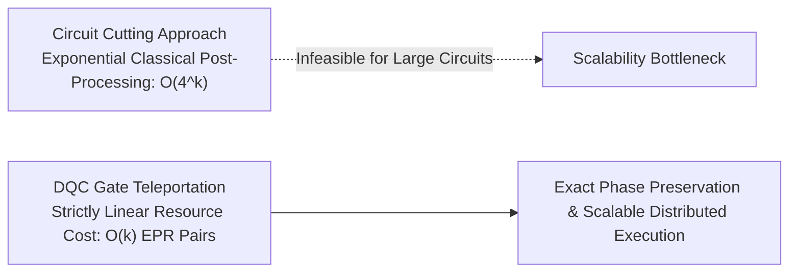

### 4. Pioneering Open-Source MLIR Infrastructure
As published in Krish Kumar Sharma's research:
> *"DQC is the first open-source MLIR-native compiler infrastructure targeting distributed quantum circuit execution with end-to-end compilation from high-level quantum IR to executable LLVM IR."*

By establishing an extensible, dialect-based compilation pipeline, DQC bridges the gap between high-level quantum algorithm development and the physical multi-QPU quantum supercomputers of tomorrow.
